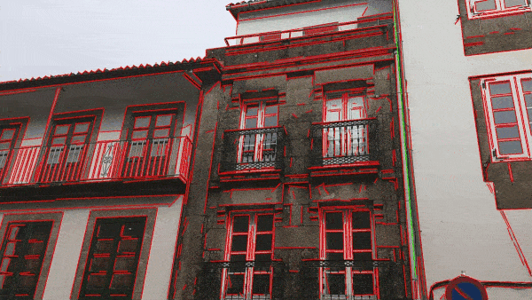
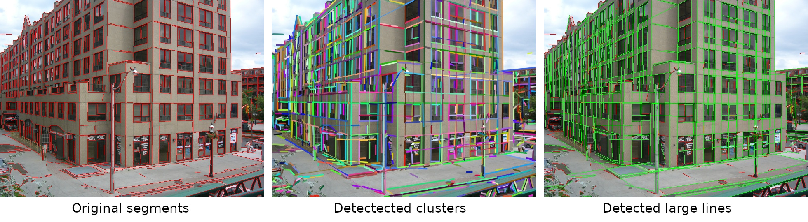

# FSG: A statistical approach to line detection via fast segments grouping


This repository contains the source code of [FSG: A statistical approach to line detection via fast segments grouping](http://www.dia.fi.upm.es/~pcr/publications/iros2018.pdf). It allows merging segments extremely fast to fix broken detections and find large lines.
The method can be used with any line segment detector. We use LSD here, as it was done in the original paper.

<p align="center">

</p>


### Compile and run

Instructions tested in Ubuntu 18.04:

```
sudo apt-get install build-essential libopencv-dev
mkdir build && cd build
cmake ..
make -j
./fsg_main
```

If everything goes well you should be able to see the following demo:



### Cite

```bibtex
@inproceedings{suarez2018fsg,
  author={Su{\'a}rez, Iago and Mu{\~n}oz, Enrique and Buenaposada, Jos{\'e} M and Baumela, Luis},
  booktitle={2018 IEEE/RSJ International Conference on Intelligent Robots and Systems (IROS)}, 
  title={FSG: A statistical approach to line detection via fast segments grouping}, 
  year={2018},
  pages={97-102},
  doi={10.1109/IROS.2018.8594434}
  }
```
